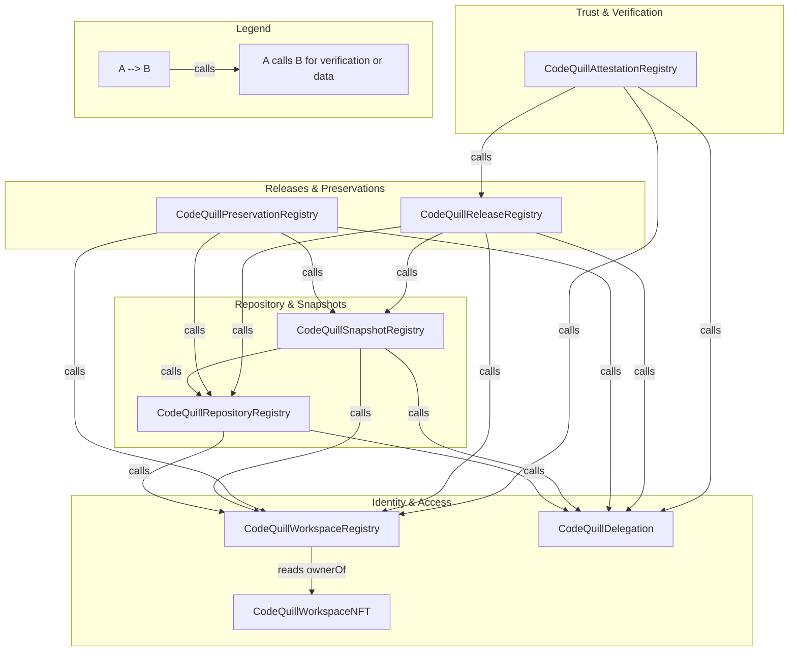
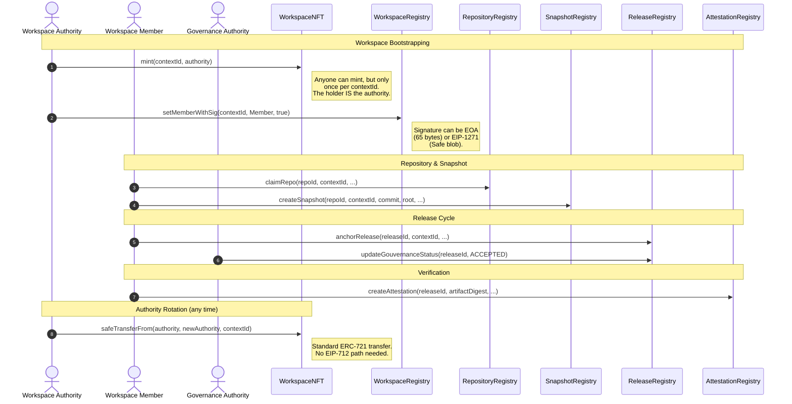

# CodeQuill Architecture

This document describes the high-level architecture of the CodeQuill smart contracts and their relationships.

## Contract Relationship Graph

The following diagram illustrates how the different registries in the CodeQuill ecosystem interact with each other and share context.

### Arrow Semantics
- **calls**: The source contract invokes a view function on the target contract to verify permissions (e.g., `isMember`, `isAuthorized`) or to validate the existence of a referenced entity (e.g., `repoOwner`, `snapshotIndexByRoot`).
- **reads ownerOf**: `CodeQuillWorkspaceRegistry.authorityOf(contextId)` is a thin wrapper over `CodeQuillWorkspaceNFT.ownerOf(uint256(contextId))`. This means **transferring the workspace NFT transfers workspace authority** — there is no separate authority-rotation function.
- **stores address/reference**: Implicit in the "calls" relationship, as dependent contracts store the immutable addresses of the registries they interact with. Specifically, the WorkspaceRegistry stores the WorkspaceNFT address as `immutable`.

---

## Authority and Recovery

Every workspace has exactly one ERC-721 token in `CodeQuillWorkspaceNFT`. The token holder is the workspace **authority**: the only signer who can add or remove members, and the implicit member-of-record for every other registry's `isMember` checks.

Because authority is an NFT, the protocol gets four properties:

1. **Compromise resistance via Safes.** The NFT can be held in a Gnosis Safe (or any EIP-1271 contract wallet). The `setMemberWithSig` function in WorkspaceRegistry verifies signatures via OpenZeppelin's `SignatureChecker`, which falls through to `IERC1271.isValidSignature` for contract authorities. So a compromised Safe owner key does not compromise the workspace as long as the Safe's policy still requires more signers.
2. **Standard recovery.** Authority rotation is just `safeTransferFrom`. To move ownership to a new wallet, the current holder signs the standard ERC-721 transfer in their wallet (or via Safe Tx Builder for a Safe). No bespoke EIP-712 signing path needed.
3. **No accidental authorization.** `approve` and `setApprovalForAll` on the WorkspaceNFT revert with `ApprovalsDisabled`. The current holder must transfer the workspace themselves; they cannot delegate that power to a marketplace operator or a dapp's "approve all" prompt. Both EOA and Safe transfers still work because the holder is always `msg.sender` for those calls.
4. **Workspace-scoped downstream permissions.** Snapshot, Preservation, and Release-revoke/supersede check `workspace.isMember(contextId, author)` rather than pinning to a historical wallet (e.g. the repo's claim address or the release's original author). Rotating the workspace NFT therefore rotates practical authority over every repo, snapshot, and release in the workspace, without per-resource transfers. The release's *governance* role stays pinned by design — it's a deliberate separation-of-duties surface.

Regular EOA users see no friction: the NFT lives in their wallet like any other ERC-721, and `setMemberWithSig` accepts ordinary 65-byte ECDSA signatures unchanged.

See [CodeQuillWorkspaceNFT](./CodeQuillWorkspaceNFT.md) and [CodeQuillWorkspaceRegistry](./CodeQuillWorkspaceRegistry.md) for the full design.

---

## Key User Journey: Software Release Flow

The most central journey in CodeQuill is the path from claiming a repository to anchoring an attested release.

---

## Detailed Contract Documentation

For more information on the internal data structures and logic of each registry, please refer to the following documents:

*   **Identity & Access**:
    *   [CodeQuillWorkspaceNFT](./CodeQuillWorkspaceNFT.md)
    *   [CodeQuillWorkspaceRegistry](./CodeQuillWorkspaceRegistry.md)
    *   [CodeQuillDelegation](./CodeQuillDelegation.md)
*   **Repository & Snapshots**:
    *   [CodeQuillRepositoryRegistry](./CodeQuillRepositoryRegistry.md)
    *   [CodeQuillSnapshotRegistry](./CodeQuillSnapshotRegistry.md)
*   **Releases & Preservations**:
    *   [CodeQuillReleaseRegistry](./CodeQuillReleaseRegistry.md)
    *   [CodeQuillPreservationRegistry](./CodeQuillPreservationRegistry.md)
*   **Trust & Verification**:
    *   [CodeQuillAttestationRegistry](./CodeQuillAttestationRegistry.md)

---

## How to keep this updated

1. **New Registries**: If a new registry is added, add it to the appropriate subgraph in the Relationship Graph and define its dependencies.
2. **Interface Changes**: If the interaction pattern between contracts changes (e.g., a contract starts depending on another one it didn't use before), update the Mermaid arrows.
3. **New User Journeys**: If significant new functionality is added (e.g., a new DAO integration or complex delegation logic), consider adding a new sequence diagram.
